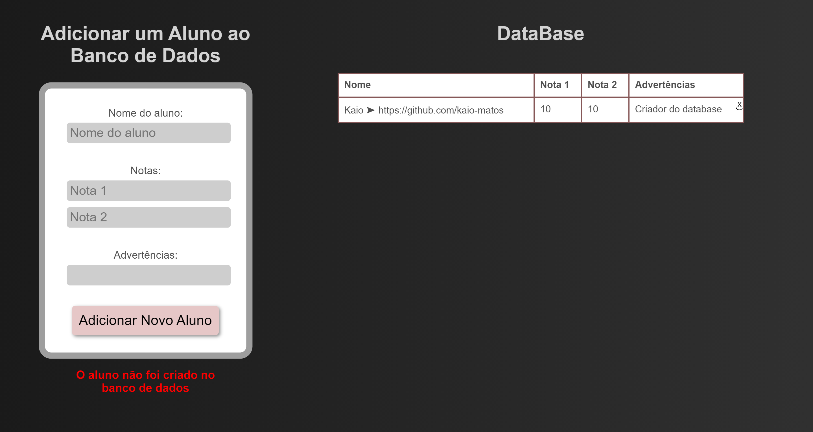

# Banco de dados para escolas

Projeto feito para praticar o uso do firestore, adicionando e apagando documentos do banco de dados através do Javascript.

[Site](https://kaio-matos.github.io/banco_de_dados-escola)

## Desktop Site

[Meu Linkedin](https://www.linkedin.com/in/kaio-matos-9532271a5)
